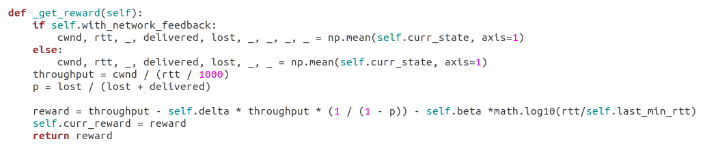

# Application of Reinforcement Learning to Computer Networks
This repo is mainly intended for NOMS 2023 tutorial and outlines the steps on how to use the _**OWL**_ application in a VM running ```Linux``` operating system or on a ```Linux``` standalone computer. The original repository that contains the implementation of  _**OWL**_ can be found here _**[tcp-owl](https://github.com/alessiosac/tcp-owl)**_.

For simplicity and ease of setup, we provisioned and packaged a VM with _**OWL**_ already installed and setup. Below are detailed step on how to retrieve the VM and test out the _**OWL**_ application.

# Get the VM
Visit this **[Download image](https://www.dropbox.com/sh/euk6b029w1u38mc/AACAt_UIC3dmL6IF-EWUuODMa?dl=0)** to get the VM image that contains a preinstalled _**OWL**_ application. The image format is in Open Virtual Appliance (OVA) and can be imported into any virtualization platform of your choice. We conducted our test of the image using Oracle virtualbox, hence we recommend that you use Oracle virtualbox.

The credentials are:
```bash
username: osboxes.org
password: osboxes.org
```
### Possible errors

In case the VM is not starting, you may try to: increment the memory size ```Setting/System/Base Memory``` to at least ```1024 MB``` and under ```Processor``` tab to more than ```2```.

# Load kernel module

The `kernel_module` folder includes files for the kernel implementation of the _**OWL**_ algorithm.
After importimg and starting the virtual appliance, run the following commands below to load the _**OWL**_ Linux kernel module congestion control algorithm:

```bash
$ cd tcp-owl   # change into OWL dir
$ cd kernel_module   # change into the kernel module dir
$ sudo insmod tcp_owl.ko    # load the module
```

After the module has been loaded, check to ensure that _**OWL**_ is now listed among the available congestion control algorithms by using the command below:  

```bash
$ cat /proc/sys/net/ipv4/tcp_available_congestion_control
reno cubic owl  # output
```

Then config "owl" as default congestion control for TCP
```bash
$ sudo su    # switch to root user
$ echo owl > /proc/sys/net/ipv4/tcp_congestion_control
```

or
```bash
$ sudo sysctl -w net.ipv4.tcp_congestion_control=owl
```

To unload the module from the kernel, run:
```bash
$ sudo rmmod owl
```

# Test _**OWL**_

## Run the RL model

To train the RL component, start the algorithm in the `model` directory by running:
```bash
$ cd model
$ PYTHONPATH=../ python3 train_model.py 
```

## iperf
The behavior of _**OWL**_ can be easily experienced starting a communication, e.g., using [iperf](https://iperf.fr/iperf-download.php). To test the application using iperf, follow the steps below:  

1. Open two different terminals on the Linux VM that you downloaded earlier and import into your virtual environment.  
2. In the ```home``` directories of the terminals, you will find two bash scripts ```server.sh```and ```client.sh```.
3. Start the iperf server by running the server script in one of the terminals by entering the command ```./server.sh```.
4. In the other terminal, start the client script by entering the command ```./client.sh```.
5. Observe the performance of _**OWL**_ congestion control algorithm.

## Reward engineering

The reward equation is set in the  ```tcp-owl/environment/kernel_env.py``` file as in the figure:



Where ```self.delta``` and ```self.beta``` are two coefficients determining the importance of packet losses and RTT.

We can try to change these values in ```tcp-owl/model/config1.ini``` and see the effects, e.g.,
```bash
delta = 0.5 beta = 0.0
delta = 0.5 beta 0.3
delta = 0.0 beta = 0.5
```

## Pick your own reward to beat other participants

Now choose the combination that in your mind might perform better and try to maximize the throughput (ideally it should be 100 Mbps).

```bash
$ ./client.sh
```

## mahimahi
To reproduce many different link conditions we use [Mahimahi](http://mahimahi.mit.edu/) network emulation tool.  

To test the _**OWL**_ protocol with mahimahi tool, use the following steps below:

1. Start the iPerf3 server on one terminal using the command ```./server.sh```.
2. Open a new terminal and enter the command ```mm-delay 50```. This starts up a mahimahi shell with a specified network delay of 50 milliseconds. An example of the mahimahi shell is shown below:
```
[delay 50 ms] osboxes@osboxes:~$
```
3. On thesame mahimahi shell, start the mahimahi iPerf3 client on the terminal using the command ```./mahi-mahi_client.sh```. In the script, the iPerf3 client uses the mahimahi default namespace IP address to connect with the iPerf3 server with the specified delay on the mahimahi shell.
 
 file:///home/marshall/Pictures/Screenshots/mahimahi_throughput.png
